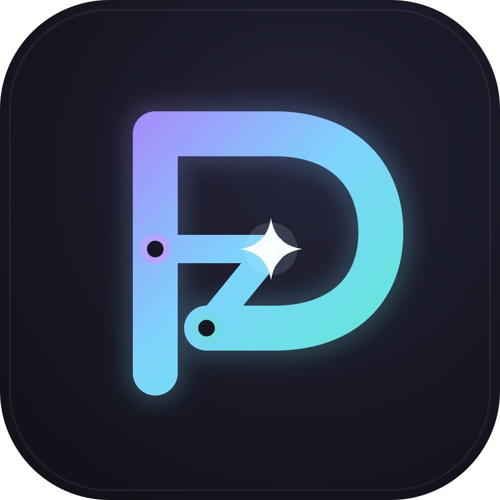
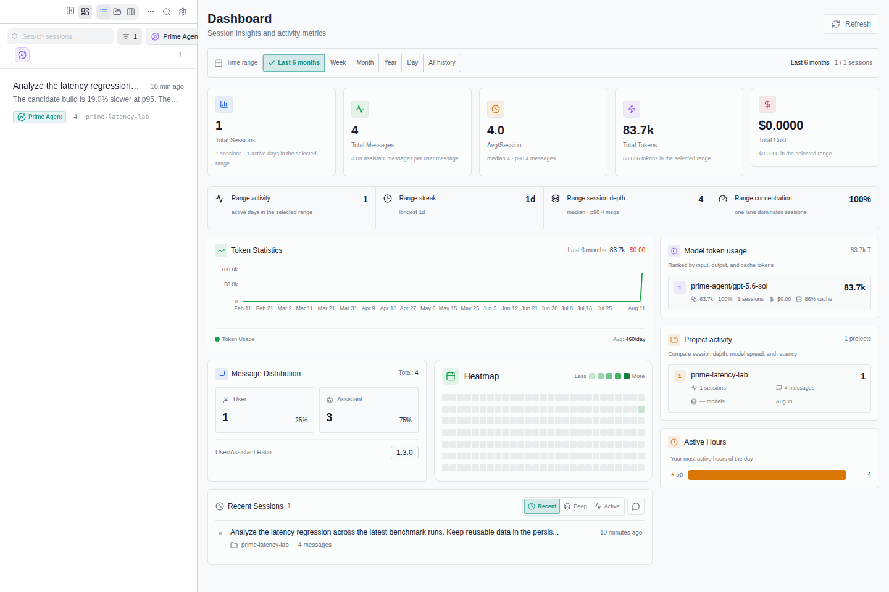
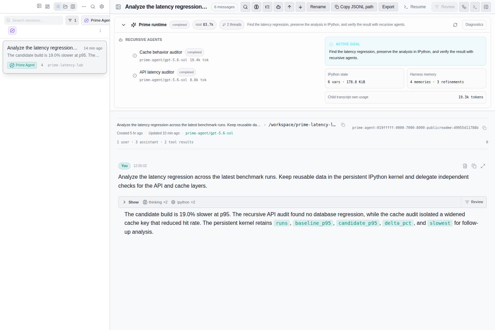
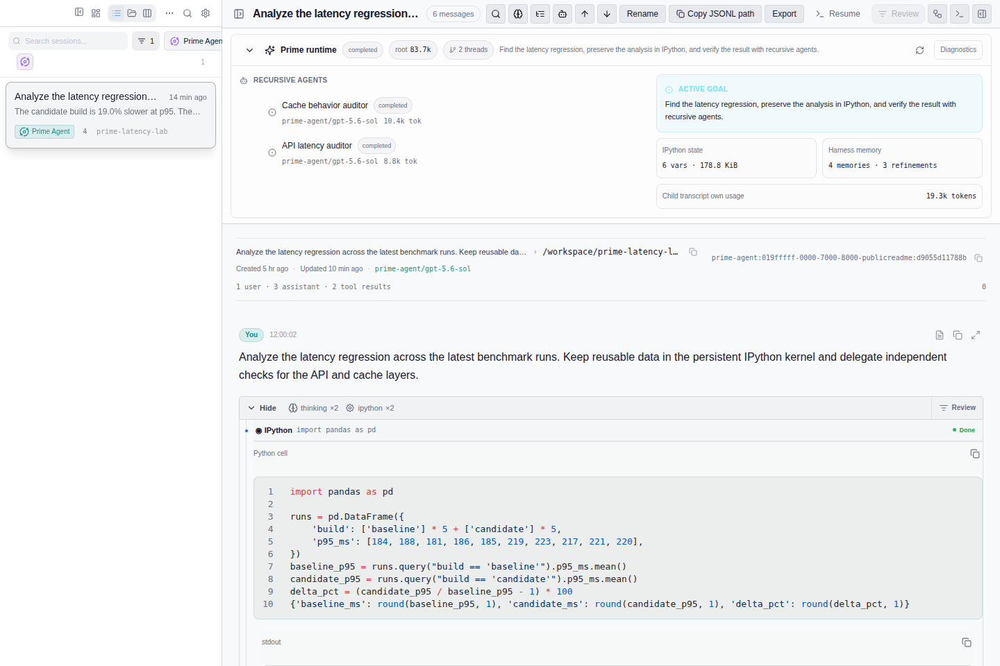
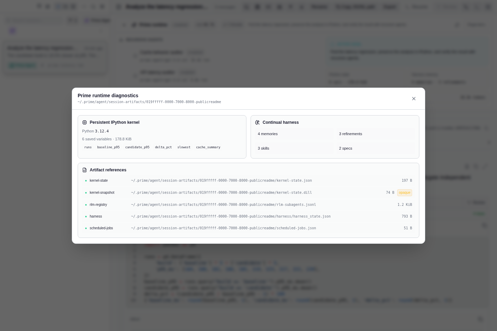

# Prime Agent Session Manager

<p align="center">
  
</p>

<p align="center">
  <strong>Prime Agent Web UI — 在本地查看 trace、递归 Agent 与持久化 IPython 工作。</strong>
</p>

<p align="center">
  <a href="https://github.com/dat-lequoc/prime-agent-session-manager">源码</a> ·
  <a href="https://github.com/dat-lequoc/prime-agent-session-manager/releases">Releases</a> ·
  <a href="https://github.com/Dwsy/pi-session-manager">上游项目</a> ·
  <a href="README.md">English</a>
</p>

## 安装并运行

macOS / Linux：

```bash
curl -fsSL https://raw.githubusercontent.com/dat-lequoc/prime-agent-session-manager/main/scripts/install-cli.sh | bash
pi-session-cli
```

Windows PowerShell：

```powershell
iwr -useb https://raw.githubusercontent.com/dat-lequoc/prime-agent-session-manager/main/scripts/install-cli.ps1 | iex
pi-session-cli
```

打开 **[http://127.0.0.1:52131/#/projects](http://127.0.0.1:52131/#/projects)**。首页默认只显示 Prime Agent 会话与项目；可通过来源筛选器加入 Pi、Codex、Claude Code、OpenCode、Gemini CLI 等支持的 Harness。

安装器会下载当前平台的最新 Release，并安装兼容命令名 `pi-session-cli`。使用 `--help` 可查看版本、安装目录、确认与校验选项。

## 界面预览

| Prime 项目与会话统计 | 包含递归 Agent 的 Prime trace |
|---|---|
|  |  |

| 持久化 IPython 执行 | Runtime 诊断与保留资产 |
|---|---|
|  |  |

## Prime Agent 支持

- 自动发现 `~/.prime/agent/sessions` 中的会话和 `~/.prime/agent/session-artifacts` 中的 Runtime 资产。
- 重建递归 RLM 子 Agent 活动，并展示状态、模型、token 使用量和可展开 transcript。
- 将持久化 IPython 调用显示为清晰的 cell，包括源码、stdout、结果、错误与保留的 Kernel 变量。
- 汇总当前目标、Harness memories、refinements、skills、specs、scheduled jobs 与资产健康状态。
- 保留 thinking、工具调用、会话分支、compaction context、模型使用量、token、费用和项目统计。
- 默认筛选 Prime Agent，同时保留上游 Provider 生态的兼容能力。

## 运行模式

| 模式 | 命令 | 地址 |
|---|---|---|
| 已安装的本地 Server | `pi-session-cli` | `http://127.0.0.1:52131` |
| 前端开发 | `pnpm run dev` | `http://127.0.0.1:1420` |
| CLI 开发 | `pnpm run cli:dev` | 前端 `1420`，后端 `52131` |
| Desktop 开发 | `pnpm run tauri:dev` | Tauri 窗口 + Vite HMR |
| 只读本地 Server | `PSM_READ_ONLY=1 pi-session-cli` | `http://127.0.0.1:52131` |

CLI 从 `~/.pi/pi-session-manager/config.json` 读取绑定地址、端口、认证与会话设置。服务开放到本机以外时，请启用认证并使用 TLS。

## 常用路由

Web UI 使用 Hash Route，因此相同链接可用于 Desktop App 与本地 Server。

| 路由 | 说明 |
|---|---|
| `/#/projects` | 首页、项目 Dashboard 与来源筛选器 |
| `/#/projects/<project-path>` | 单个项目中的会话 |
| `/#/sessions/<session-id>` | 已索引会话详情 |
| `/#/open/<native-session-id>` | 通过原生 Session ID 查找并打开会话 |
| `/#/dashboard` | 跨会话统计 |

## 从源码构建

需要 Node.js 22+、pnpm、Rust 1.97+ 与 Git。

```bash
git clone https://github.com/dat-lequoc/prime-agent-session-manager.git
cd prime-agent-session-manager
corepack enable
pnpm install
pnpm run build:cli
./target/release/pi-session-cli
```

Desktop App：

```bash
pnpm run tauri:dev
# 或创建生产构建
pnpm run tauri:build
```

## 开发验证

```bash
pnpm run build
pnpm exec vitest run
cargo fmt --all --check
cargo clippy --workspace --all-targets -- -D warnings
cargo test --workspace
```

更多文档：

- [Agent 指南](AGENTS.md)
- [开发指南](agent-docs/04-development.md)
- [扩展概览](extensions/README.md)
- [Plugin SDK](docs/PSM_PLUGIN_SDK.md)

## 许可与上游署名

Prime Agent Session Manager 是 [Pi Session Manager](https://github.com/Dwsy/pi-session-manager) 的 MIT License 分支。原项目由 [Dwsy](https://github.com/Dwsy) 创建；原始架构、产品基础与上游实现归功于 Dwsy 和所有上游贡献者，本项目建立在他们的工作之上。

本分支加入 Prime Agent 集成与重新设计的品牌体验，同时保留 MIT License 与上游署名。详见 [LICENSE](LICENSE) 和 [NOTICE.md](NOTICE.md)。

## macOS Gatekeeper

本地构建或未签名的 Desktop App 可能需要移除 quarantine：

```bash
sudo xattr -rd com.apple.quarantine "/Applications/Prime Agent Session Manager.app"
```
